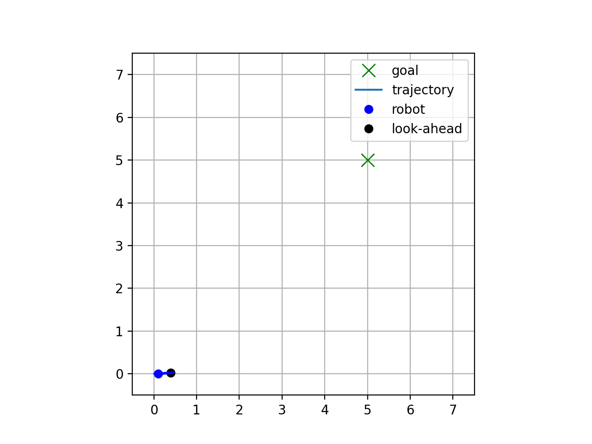

# Safety-Constrained Navigation with CBF-QP

## Overview
This project explores safety-constrained control for autonomous navigation using Control Barrier Functions (CBFs) and Quadratic Programming (QP).

I implemented and compared multiple control formulations:
- PID (baseline)
- CLF-CBF-QP
- CBF-QP (final approach)

The goal is to achieve stable trajectory tracking while ensuring real-time obstacle avoidance.

---

### CLF-CBF-QP Behavior Comparison

| With Dynamic Obstacles | Without Obstacles |
|------------------------|-------------------|
|  |  |

- Successfully avoids **moving obstacles**
- However, without obstacles, the robot follows a **curved and inefficient trajectory**
- This highlights unintended coupling between **CLF stability constraints** and control inputs

---

### 💡 Key Takeaway

While CLF-CBF-QP ensures safety and theoretical stability, it introduces:
- **Directional inefficiency** in unconstrained environments  
- **Sensitivity to tuning (e.g., slack variables)**  
- Unnecessary complexity for simple navigation tasks  

➡️ This motivated the transition to a **CBF-QP + nominal controller**, which achieves more direct and consistent goal-reaching behavior.

---

## Final Result (CBF-QP)

- Smooth trajectory to goal
- Reliable avoidance of **dynamic obstacles**
- Minimal tuning required

---

## Key Insight

While CLF-CBF-QP provides theoretical stability guarantees, in practice:

- The robot followed **curved trajectories even without obstacles**
- Required careful tuning of **slack variables**
- Introduced unnecessary complexity into the controller

By removing the CLF term and using a **CBF-QP formulation with a nominal controller**, I achieved:

- More **direct trajectories to the goal**
- Improved **directional consistency**
- Simpler and more interpretable control structure

---

## Method Comparison

| Method        | Pros                          | Cons                                   |
|--------------|-------------------------------|----------------------------------------|
| PID          | Simple baseline               | No safety guarantees                   |
| CLF-CBF-QP   | Stability + safety guarantees | Curved paths, difficult tuning         |
| CBF-QP       | Simple, robust, consistent    | No explicit CLF stability guarantee    |

---

## Approach

### CLF-CBF-QP (Initial)
- Combined Control Lyapunov Function (CLF) and Control Barrier Function (CBF)
- Enforced stability + safety via QP constraints
- Included slack variable for feasibility

➡️ See branch: [`clf_cbf_qp`](https://github.com/MokeyCodes/clf-cbf-robot/tree/clf_cbf_qp)

---

### CBF-QP + Nominal Controller (Final)
- Removed CLF component
- Used a **nominal tracking controller** for goal-seeking
- Applied CBF constraints for safety
- Introduced a lookahead point to improve numerical stability and reduce oscillatory behavior in control near obstacles.

This decouples:
- **Goal tracking** (nominal control)
- **Safety enforcement** (CBF)

---

## 🛠️ Tech Stack
- Python
- NumPy
- CVXPY (QP solver)
- Matplotlib (simulation + animation)

---